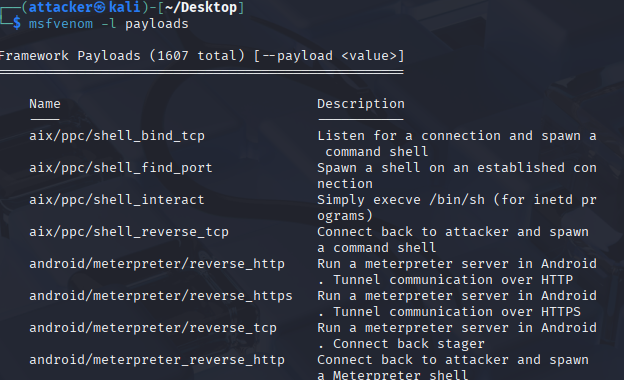
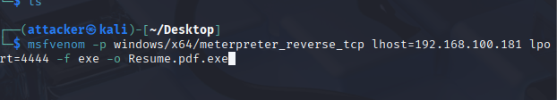
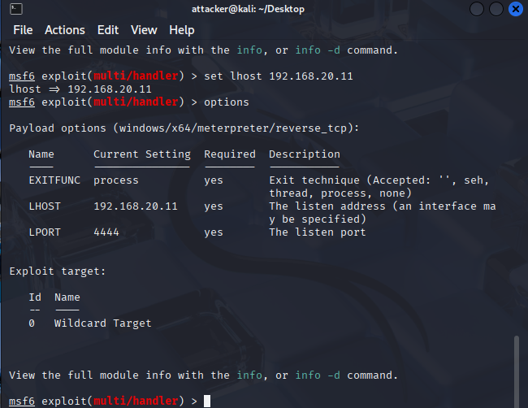
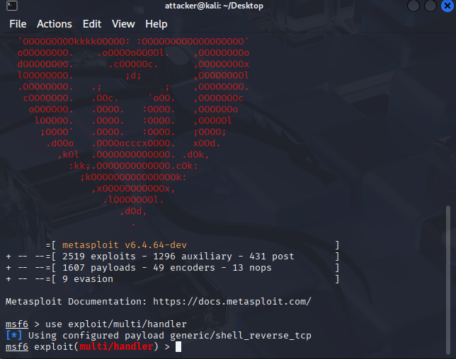

# Day 1 – Home Lab Journey

The first day of my home lab setup was all about getting the basics working and making sure everything could talk to each other. I started by creating two virtual machines: a Linux attacker box and a Windows 11 defender. Using NAT networking, both machines were able to get online so I could grab the tools I needed, mainly Splunk and Sysmon for future log monitoring. The screenshots below show the early setup stages:  
  

Once everything was installed, I wanted to keep things safe, so I disconnected them from the internet and switched both to an internal adapter. That way they could only talk to each other and not the host. To keep the network consistent, I gave each machine a static IP:  
  

To check if it all worked, I pinged the Linux machine from Windows and saw replies coming back, which felt like a small win:  

After confirming connectivity, I decided to explore what would happen if the firewall was off. I disabled it briefly and saw a lot of ports open:  
  

One of the open ports was RDP, and since I’m new to attack testing, I wanted to experiment. I created a payload using msfvenom, disguising it as a PDF-looking executable (`Resume.PDF.exe`). If someone had extensions hidden, it would only look like a PDF. Here’s the payload and handler setup:  
  
  
  

Finally, to serve the file, I spun up a quick Python HTTP server and hosted it on port 9999. The malicious file could be downloaded directly from the server, and I tested it on the defender machine:  
  

The first day ended day for me as i was experincing with the Malware, i releasied Windows 11 did not support RDP. I will be experimenting more attacks and using Blue Team apps soon. 
