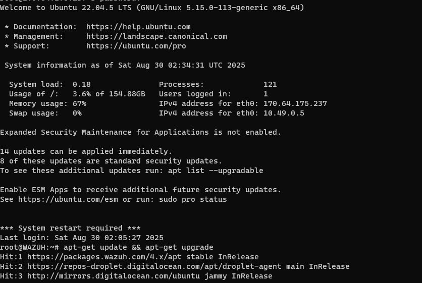
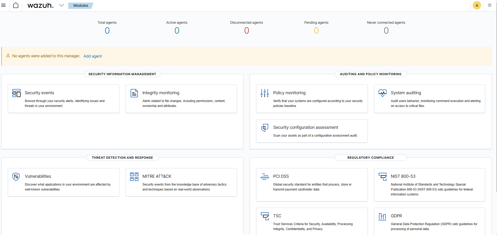
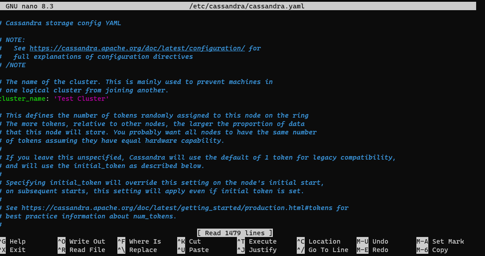
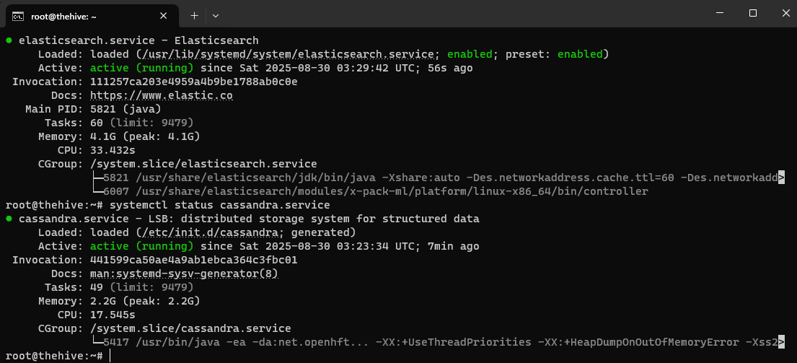
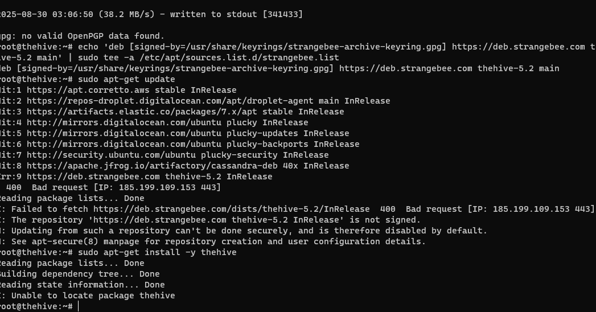
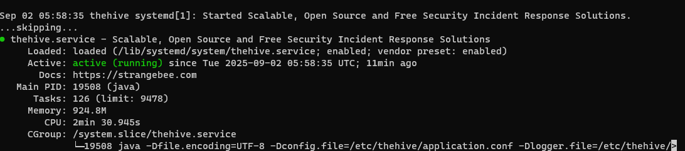
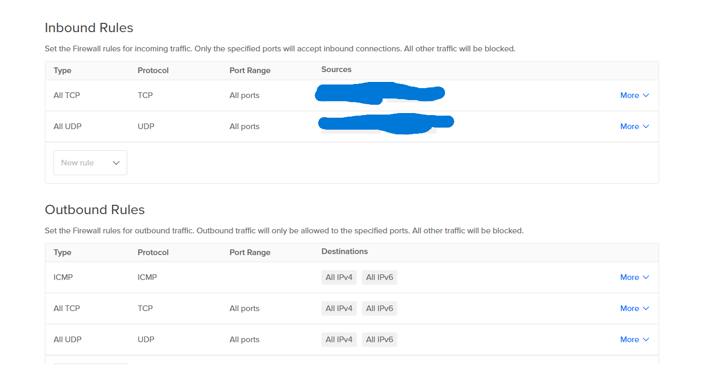

# 📘 Day 2 – Installing Wazuh, TheHive, Cassandra & Elasticsearch  

Today I spent most of the day setting up the core stack on my cloud droplets. I SSH’d into the servers from my own computer and worked directly off the terminal. The focus was on getting **Wazuh**, **TheHive**, **Cassandra**, and **Elasticsearch** all running together.  

---

## 🔧 Installation Process  

I started with **Wazuh**, running the installation script and configuring the manager. The install went mostly fine, and I was able to access the Wazuh dashboard after the setup.  

  
  

Next, I moved on to **Cassandra** and **Elasticsearch** since they are required dependencies for TheHive. Cassandra configured without much issue, and Elasticsearch initially looked fine.  

  
  

---

## ⚠️ Issues Faced  

The real problems came when I tried to run **TheHive**. The service wouldn’t start properly, and I kept running into errors during installation.  

  

After troubleshooting, I realised the root cause was the **Java version** — my droplets had an older version installed, and TheHive simply refused to run with it. I had to upgrade Java and reinstall TheHive from scratch.  

---

## ✅ Current Status  

Once I reinstalled TheHive with the correct Java version, the service finally launched successfully.  

  

At this point:  
- Wazuh is installed and working, but no agents are connected yet.  
- Cassandra and Elasticsearch are both up and running.  
- TheHive service is finally online and ready for use.  

---

## 🔒 Network & Security  

I also reviewed firewall rules to make sure my droplets were properly locked down and only the required ports were open.  

  

---

## 📌 Summary  

Day 2 was a bit of a grind with misconfigurations and failed installs, but I learned a lot about dependency management and version control. The biggest lesson was how critical the **Java environment** is for TheHive to run.  

---

👉 Tomorrow, I’ll move on to installing agents and connecting them to Wazuh for log collection.  
